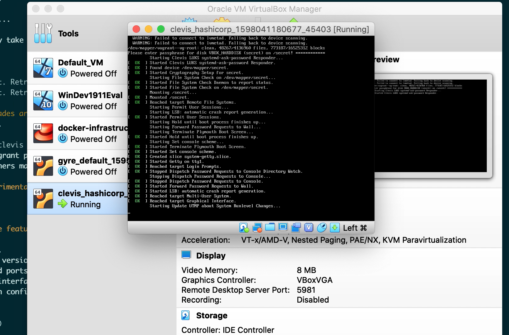

# Notes from testing with vagrant drive

Notes from a sample setup using vagrant. Most of this is configuration and fighting with systemd boot order issues. Some is specific to virtualbox.

## Vagrant setup notes

Need to run vagrant with experimental settings: https://www.vagrantup.com/docs/disks/usage: `export VAGRANT_EXPERIMENTAL="disks"` before `vagrant up`

Check disks: `fdisk -l`. Should see `/dev/sdb`.
Add scripts: `cp /vagrant/src/pins/keyscript/clevis-* /usr/bin/`

### Encrypt and decrypt

```
root@vagrant:/vagrant/src/pins/keyscript# echo "hello world" | clevis encrypt keyscript '{"keyscript": "/vagrant/src/pins/keyscript/example-keyscript"}' > enc.jwe
root@vagrant:/vagrant/src/pins/keyscript# clevis decrypt < enc.jwe
hello world
```

### Disks

```
# Initial setup
cryptsetup --verify-passphrase luksFormat /dev/sdb
cryptsetup luksOpen /dev/sdb secret
mkfs.xfs /dev/mapper/secret
mkdir /secret
mount /dev/mapper/secret /secret
```

### Machina CLI

```bash
# Download tarball
curl -L https://github.com/IonicDev/ionic-machina-cli/releases/download/1.8.0/machina-Linux-Default_1.8.0-8.tar.gz -o machina-Linux-Default_1.8.0-8.tar.g
cp machina/machina /usr/local/bin/
cp machina/machina.1 /usr/share/man/man1/

# Add profile downloaded from console
cp <profile> /root/ionic_profile.pt
chmod 600 /root/ionic_profile.pt

# Create key
machina -t plaintext -f ~/ionic_profile.pt key create -a 'com.ionic.application.luks.disk:/dev/sdb,com.ionic.application.luks.mount:/secret' -m 'ionic-application-name:luks-keyscript,ionic-application-version:0.0.1'

# Fetch key bytes
# See machina-fetch-keyscript
```

### Service config

Set up service config dir so we don't need the host-mounted dir contents to auto-mount the LUKS drive.

```bash
cd /vagrant/src/pins/keyscript

# Creating dir
mkdir /etc/luks-keyscript
cp service-mount-helper /etc/luks-keyscript/
cp machina-fetch-keyscript /etc/luks-keyscript/
```

### Clevis

```bash
# Bind disk
clevis bind luks -d /dev/sdb keyscript '{"keyscript": "/etc/luks-keyscript/machina-fetch-keyscript"}'

# Check bound
cryptsetup luksDump /dev/sdb
luksmeta show -d /dev/sdb

# Close
cryptsetup close /dev/mapper/secret

# Manually unlock and mount
clevis luks unlock -d /dev/sdb -n secret
mount /dev/mapper/secret /secret
```

## Auto-mount

### With crypttab and fstab

```bash
# In crypttab
echo secret   /dev/sdb none _netdev >> /etc/crypttab

# In fstab
/dev/mapper/secret         /secret                 xfs         _netdev        1    2

# Try out unmount/mount
umount secret
ls -l /secret
mount -a
ls -l /secret

# Start repsonser service
systemctl enable clevis-luks-askpass.path
```

Here I ran into issues. The responser service seems to start too late.  This is the definition for the path file

```bash
root@vagrant:/home/vagrant# cat /lib/systemd/system/clevis-luks-askpass.path
[Unit]
Description=Clevis systemd-ask-password Watcher
Before=remote-fs-pre.target
Wants=remote-fs-pre.target

[Path]
PathChanged=/run/systemd/ask-password

[Install]
WantedBy=remote-fs.target
```

I tried changing `remote-fs-pre.target` to `local-fs-pre.target` (per https://www.freedesktop.org/software/systemd/man/systemd.special.html), but that didn't work.

This is what the view in the VM console looks like: it pauses for a password, then starts the service *after* I enter the pass phrase.



### Debugging automounting

* https://help.ubuntu.com/community/Fstab#Options
    * Mentions that _netdev mount option indicates the drive is a network device and should be brought up after network, but this is only valid for nfs
* https://unix.stackexchange.com/questions/169697/how-does-netdev-mount-option-in-etc-fstab-work
    * The _netdev option for fstab
* https://www.freedesktop.org/software/systemd/man/crypttab.html
    * The _netdev option for crypttab
    * If used in crypttab, should also be used in fstab
* http://codingberg.com/linux/systemd_when_to_use_netdev_mount_option
    * when to use _netdev
    * indicates that systemd detects most fs that need network automatically (e.g. nfs, glusterfs)
    * also needed for drives on iscsi connection
* https://oguya.ch/posts/2015-09-01-systemd-mount-partition/
    * systemd mounts are created dynamically at runtime from fstab entries
* https://unix.stackexchange.com/questions/486934/mounts-of-systemd-service-script-disappear
    * can use oneshot for complex mounts instead of crypttab and fstab
* https://bugzilla.redhat.com/show_bug.cgi?id=1810332
    * Helpful recent conversation on setting up clevis auto-unlock in fedora (mostly on LVM / grub partitions)

### Using a oneshot sevice

```bash
cd /vagrant/src/pins/keyscript

cp mount-enc-secret-dir.service /etc/systemd/system/
systemctl enable mount-enc-secret-dir.service

# Can also use start, stop, status
```

This ended up working after a bit of fiddling to

* move all scripts off the shared folder (since this is mounted late)
* adding a pre-start to make sure network is ok

## All files in package

Main package

```bash
/usr/bin/clevis-decrypt-keyscript
/usr/bin/clevis-encrypt-keyscript
/etc/systemd/system/mount-enc-secret-dir.service
/etc/luks-keyscript/service-mount-helper
```

Machina-specific

```bash
/etc/luks-keyscript/machina-fetch-keyscript
/root/ionic_profile.pt

# From machina package
/usr/local/bin/machina
```

Configuration

* The one-shot service file, since that is specific per directory
  * Users could configure this with a list of dirs to update
* All of details in `service-mount-helper` and `machina-fetch-keyscript`
  * E.g. the key, keyspace, etc

Overall notes

* I ended up abandoning the fstab+crypttab setup because it seems ubuntu wasn't respecting _netdev and was trying to mount the drive (and hence asking for a passphrase) before the clevis askpass program started (which should have started before network drives)
  * The one-shot service was a bit more flexible, and allows us to run a few more checks
* I need to think about user experience and how to minimize the configuration someone needs to add
  * First we need to package core utils into rpm/deb
  * Then a drop-in directory probably makes sense to capture per-drive config so we can configure auto-mounting per drive
  * This will end up looking quite a bit like fstab/crypttab, so it may still be worthwhile to see if we can get things to work more directly

